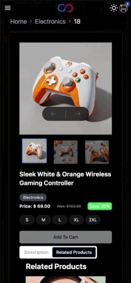

# Webook E-Commerce

## Introduction **📺**

### This is an E-Commerce Application built with `NextJs` with `user experience` and `solid architecture` in mind.

In this documentation i will give you an overview about the project with details , grab a cup of coffee ☕

### Requirements

- Implementing the main page, detail page.

- Ensuring type safety using typescript.

- Using TailwindCSS.

- Ensuring support of modern web browsers.

- Ensuring Responsive web design.

- Applying Zoom or Gallery view to the main product image.

- Applying Next and previous products navigation.

- Adding Cart functionality using any state management.

#### In the rest of the project, i will discuss how i tried to achieve all these requirements.

### Principles and goals

---

Since day 1 principles and goals where set to be able to deliver a good quality and to fulfill the requirements in an elegant, and modern way.

#### So the goals were as following :

1. To enable some level of modularity, I made sure that i am following the separation of concerns principle [SOLID].
2. Dark/light mode support.
3. Following ES6 best practices.
4. Responsiveness across all devices (desktop,mobile).
5. Ensuring UX best practices.
6. Ensuring SEO best practices.
7. Rely mostly on server side rendering.
8. Making Sure all core web vitals are

## Architecture

- I've used `NextJs`, `Tailwind` and `Typescript`, responsiveness and modularity were kept in mind too while implementing the project, I've tried as much as possible to divide the files and the components in a well-structured manner, for better reusability of the shared components and for making it easier to develop and maintain the code.
- I've also used some components from `Chadcn UI`.

### File Structure

```shell
├── app
│   ├── [locale]
│   │   ├── LayoutClient.tsx
│   │   ├── category
│   │   │   └── [categoryId]
│   │   │       └── page.tsx
│   │   ├── error.tsx
│   │   ├── head.tsx
│   │   ├── layout.tsx
│   │   ├── page.tsx
│   │   ├── product
│   │   │   └── [id]
│   │   │       └── page.tsx
│   │   └── translations.ts
│   ├── globals.css
│   ├── providers
│   │   └── providers.tsx
│   └── sitemap.ts
├── components
│   ├── Modules
│   │   ├── CategoryCarouselModule.tsx
│   │   ├── CategoryContent.tsx
│   │   ├── ProductCarousel.tsx
│   │   └── RelatedProductsCarousel.tsx
│   ├── Product
│   │   ├── Common
│   │   │   ├── ProductImage.tsx
│   │   │   ├── ProductPrice.tsx
│   │   │   └── ProductVariants.tsx
│   │   ├── Gallery.tsx
│   │   └── ProductBox
│   │       ├── CarouselProductBox.tsx
│   │       ├── CartProductBox.tsx
│   │       ├── ProductBox.tsx
│   │       └── ProductBoxFull.tsx
│   ├── common
│   │   ├── AddToCartBtn.tsx
│   │   ├── Carousel.tsx
│   │   ├── ErrorView.tsx
│   │   ├── Filters
│   │   │   ├── Filters.tsx
│   │   │   └── SelectFilter.tsx
│   │   ├── Icon.css
│   │   ├── Icon.tsx
│   │   ├── Loaders
│   │   │   └── Skeleton.tsx
│   │   ├── Logo.tsx
│   │   ├── Pill.tsx
│   │   ├── ProductCarousel.tsx
│   │   ├── ProductImageSlider.tsx
│   │   └── ThemeSwitcher.tsx
│   ├── layout
│   │   ├── Cart.tsx
│   │   ├── Footer.tsx
│   │   ├── LanguageSwitcher.tsx
│   │   ├── MobileNavBar.tsx
│   │   └── Navbar.tsx
├── contexts
│   ├── AppContext.tsx
│   └── ThemeContext.tsx
├── lib
│   ├── Icon.ts
│   ├── helpers
│   │   ├── constants.ts
│   │   ├── generic.ts
│   │   └── locale.ts
│   ├── hooks
│   │   ├── useInView.tsx
│   │   └── useOutsideClick.tsx
│   ├── types.ts
│   └── utils.ts
├── middleware.ts
├── productBackup.ts
├── public
│   ├── NotFoundLogo.tsx
│   ├── icons
│   │   ├── ArrowLeft.svg
│   │   ├── .....rest of icons
├── services
│   ├── CategoryService.ts
│   ├── CommonService.ts
│   └── ProductService.ts
├── tailwind.config.ts
├── translations
│   ├── ar.json
│   └── en.json
```

### Services

- I've used a free api for handling application data which gives me a free access to some dummy `apis` used in this project.
- I've created a separate file for each service , ensuring that every response coming from the api is type casted according to the types used in `types.ts`.

```shell
├── services
│   ├── CategoryService.ts   // all category related  api calls
│   ├── CommonService.ts // common apis like Navigation Data.
│   └── ProductService.ts  // all product related api calls.
```

### State Management

- I've used the `Context` in combination of `useReducer` for the state management across the whole application to keep track of the following `items` and to be share across all the `apps`.
- I've also used local storage to keep `cartItems` even to keep the cartItems even when the user closes the browser or refresh.
- Also for the theme I've used theme provider with `next-themes` to manage the theme of the whole app.
- The context and `provider` are defined in the `context` folder.
- I've made a custom hook called `useAppContext` to not to import the context and useContext hook everywhere.

| Item                               | Value                                                                           |
| ---------------------------------- | ------------------------------------------------------------------------------- |
| Cart Items                         | `TCartItems`.. <br> _Default_: []                                               |
| locale                             | holds language for the app                                                      |
| theme                              | `TTheme`. holds active theme <br> _Default_: `'light'` can be [`light`,`dark`]  |
| addToCart(product:`TCartItem`)     | function to be able to add item to the cart from any page inside the project    |
|                                    |
| RemoveFromCart(productId:`number`) | function to be able to remove item to the cart from any page inside the project |
| clearCart(product:`TCartItem`)     | function to be able to clear all items from the cart.                           |

---

### Routes

- All the application is under a dynamic route called `[locale]` where I am using the help of `middleware.ts` to check if the pathname doesn't contain `/locale` i force the application to `re-route` to `/en/route`.
- All application is under one shared layout containing the `navbar` & `footer` shared among all , also all the app is wrapped with `useQuery` provider to help in simplifying api calls.
- Application contain 3 main routes `/category/[id]` & `/product/[id]` & `page.tsx`
  - `page.tsx` -> contains main page which is used to fetch multiple different data for the user to see.
  - `/product/[id]` -> contains product detail page which is used to fetch single product details.
  - `category/[id]` -> a listing page which is used to fetch single category details and display them.
- App is ready for full support for translations but will add it some time later `@TODO` .

## User Interface 🎨

When working on UI of this project, my goals were:

- Achieving full responsiveness for all pages.
- UI Elements should respect User’s locale : RTL, and LTR `changed when you change the locale`.
- Being able to handle dynamic data(various text sizes).
- being able to be extended easily to add more elements to the UI if needed.

### Demos

|  |                       |
| --------------------------------------- | ----------------------------------------------------------- |
|  |  |

|   
White box UI Tests is achieved by FakeAppDelegate(which gets selected from main.swift in tests.), and Using EarlGrey.

### Cart Page and functionality

- To be able to achieve what was required , i used the `addTocart()` , `removeFromCart()` , `cartITems` and `clearItems` from `useAppContext` to be able to manage the state of adding to cart , also used `local storage` to be able to keep `cart` data when user closes browser.
- When cart is empty it renders to the user some items so he can have motivation to add to cart .

```typescript
const { cartItems, clearCart } = useAppContext();
```

#### Demo

| 

### Error Handling

- I've Added a global error component to make it generic and can be extended , and it let's the user don't stuck in the error page , giving him the ability to go back to `hame` , achieved through this `Errorview` component.
- So `100%` error handling is achieved.

```typescript
const ErrorView = ({
  type = ERRORVIEW.GENERIC_ERROR,
  showHomeButton = true,
}: TProps) => {
  const { subTitle, title } = getErrorInfo(type);

  return (
    <section
      aria-label="Error View"
      className="flex flex-col mt-20 items-center justify-center gap-3"
    >
      <LogoIcon />
      <h3 className="text-2xl">{title}</h3>
      <span className="text-l text-gray-500">{subTitle}</span>
      {showHomeButton && (
        <Button className="w-1/4">
          <Link href="/">Go Home</Link>
        </Button>
      )}
      <>
        <h2 className="font-l font-bold">
          Or Take Another Look At Our Products
        </h2>
        <ProductCarousel products={FALLBACK_PRODUCTS} />
      </>
    </section>
  );
};
```

### Code Modularity

- I've tried to make the components structure `clean` and to be open for extension .

#### Examples

1. Filters Component
   - I tried to make it generic so you can just add a new `filter type` and return the new filter component.

```typescript
import { TFilterOption } from "@/lib/types";
import SelectFilter from "./SelectFilter";

type TProps = {
  options: TFilterOption[];
  filterType: "select";
};

const Filters = ({ options, filterType }: TProps) => {
  switch (filterType) {
    case "select":
      return (
        <SelectFilter
          options={options}
          placeholder={placeholder}
          filterLabel={filterLabel}
        />
      );
  }
};

export default Filters;
```

2. ProductBox Component
   - I tried to make it generic so you can just add a new `productBox type` and return the new `ProductBox` component.

```typescript
import { TCartItem, TProduct } from "@/lib/types";
import React from "react";

import { PRODUCT_BOX_VARIANT } from "@/lib/helpers/constants";
import ProductBoxFull from "./ProductBoxFull";
import CartProductBox from "./CartProductBox";
import CarouselProductBox from "./CarouselProductBox";

type TProps = {
  product: TProduct | TCartItem;
  variant: PRODUCT_BOX_VARIANT;
};

const ProductBox = ({ product, variant }: TProps) => {
  switch (variant) {
    case PRODUCT_BOX_VARIANT.FULL:
      return <ProductBoxFull product={product as TProduct} />;
    case PRODUCT_BOX_VARIANT.CART:
      return <CartProductBox cartItem={product as TCartItem} />;
    case PRODUCT_BOX_VARIANT.CAROUSEL:
      return <CarouselProductBox product={product as TProduct} />;
  }
};

export default ProductBox;
```

### SEO optimizations

- I've tried to use semantic html tags , like `main` , `section` , `nav`.
- I've added `sitemap.ts` which helps search crawlers to identify the contents of the page for better ranking.

```typescript
import { getAllCategories } from "@/services/CategoryService";
import { getAllProducts } from "@/services/ProductService";
import { MetadataRoute } from "next";

export default async function sitemap(): Promise<MetadataRoute.Sitemap> {
  const locales = ["en", "ar"];

  // Fetch dynamic routes data
  const categories = await getAllCategories();
  const products = await getAllProducts();

  const dynamicCategoryPages = categories.map((category) => ({
    url: `/category/${category.id}`,
    changeFrequency: "daily" as const,
    priority: 0.7,
  }));

  const dynamicProductPages = products.map((product) => ({
    url: `/product/${product.id}`,
    changeFrequency: "weekly" as const,
    priority: 0.6,
  }));

  const allPages = [...dynamicCategoryPages, ...dynamicProductPages];

  // Generate sitemap entries for each locale
  const sitemapEntries = locales.flatMap((locale) =>
    allPages.map((page) => ({
      url: `https://localhost:3001/${locale}${page.url}`,
      lastModified: new Date().toISOString(),
      changeFrequency: page.changeFrequency,
      priority: page.priority,
    }))
  );

  return sitemapEntries;
}
```

### Middleware

- I've made sure to use `middleware.ts` offered by nextJs to intercept each request and check the `pathname` , if it doesn't contain the locale which is `en` or `ar` , will redirect the user with a status code of 308 and will append the default locale to it `en` .

```typescript
import { NextResponse } from "next/server";
import type {
  NextRequest as TNextRequest,
  NextResponse as TNextResponse,
} from "next/server";
import { getLocale } from "./lib/helpers/locale";
import { LOCALES } from "./lib/helpers/constants";

export const middleware = (request: TNextRequest) => {
  const { pathname } = new URL(request.url);
  const pathnameHasLocale = LOCALES.some(
    (locale) => pathname.startsWith(`/${locale}/`) || pathname === `/${locale}`
  );
  if (pathnameHasLocale) return;

  // Redirect if there is no locale
  const locale = getLocale(request.url);
  request.nextUrl.pathname = `/${locale}${pathname}`;

  return NextResponse.redirect(request.nextUrl, { status: 308 });
};

export const config = {
  matcher: ["/((?!_next).*)"],
};
```

### Browsers Support

- while development i've made sure that app is working smoothly among different browsers. `[safari,firefox,chrome]`.

#### Dockerization and Containerization

- I've created a `Dockerfile` and a `docker-compose.yaml` files and specified the port to be `3000` , to create a Docker Image to package the application and its dependencies.
- In order to make this image run consistently on any device without needing specific installations, ensuring a seamless setup across different environments.

### How To run

---

1. use docker
   - You just need to have docker installed and simply run the command below.

```bash
docker compose up
```

- Then you can access it on http://localhost:3000

2. Using local dev

- a. run this command to install packages

```bash
  yarn install
```

- b. start local development server
```bash
  yarn run dev
```

### Todos

- [ ] Tests
- [ ] Localization
